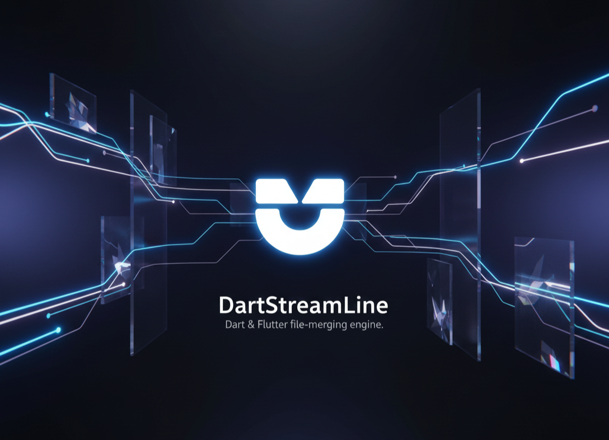

  

---

# DartStreamline - Professional Dart File Merger

A high-performance, web-based tool designed for Flutter and Dart developers who need to consolidate multiple source files into a single, valid, and optimized `.dart` file.

## Key Features
- **Deterministic Merge**: Maintains user-defined file order.
- **Smart Import Deduplication**: Combines all `import`, `export`, and `part` statements, sorts them (dart: -> package: -> relative), and removes duplicates while preserving aliases.
- **Structural Analysis**: Scans for top-level declarations (Classes, Mixins, Enums, Extensions) and detects naming collisions.
- **Conflict Detection**: Flags multiple `main()` functions and duplicate class/function names across files.
- **Local-First Architecture**: Your code never leaves your browser. All parsing is done client-side using a custom structural analysis engine.

## Architecture
The application is built with **React 18** and **TypeScript**, utilizing a custom-built `DartParser` engine. 

### Merge Algorithm
1. **Extraction**: Each file is stripped of its import blocks.
2. **Analysis**: Imports are collected into a global registry.
3. **Deduplication**: Imports with the same path, alias, and show/hide parameters are flattened.
4. **Sorting**: Imports are grouped by type and sorted alphabetically within groups.
5. **Assembly**: 
   - A header comment is added.
   - The unified import block is injected.
   - Source files are appended in the user's specified order, separated by structural comments.

## Setup Instructions
1. Ensure you have Node.js installed.
2. Run `npm install` to install dependencies.
3. Run `npm start` to launch the development server.
4. Upload `.dart` files via the drag-and-drop interface.

## Known Limitations
- **Indentation**: The tool preserves original indentation but does not perform a full re-format (like `dart format`).
- **Logic Overlap**: Does not resolve logic conflicts beyond naming collisions.
- **Parts**: While `part` statements are collected, it is recommended to merge the "parts" manually through the tool for best results.
